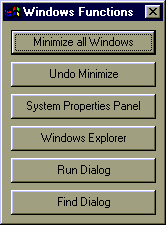



## Windows Key Stuff \(Updated\!\) and easy API lesson

### Description

Here's a few neat things to can do to emulate Windows-key presses from your app without too much headache. A good starter article and easy reading for those new with the API.

If you like the way this was done, be sure to vote and let me know. This is my first article and I would really like to know what you think.
 
### More Info
 

             |
---                |---
**Submitted On**   |2000-11-07 21:01:14
**By**             |[Brandon McPherson](https://github.com/Planet-Source-Code/PSCIndex/blob/master/ByAuthor/brandon-mcpherson.md)
**Level**          |Intermediate
**User Rating**    |4.7 (66 globes from 14 users)
**Compatibility**  |VB 4\.0 \(32\-bit\), VB 5\.0, VB 6\.0
**Category**       |[Windows API Call/ Explanation](https://github.com/Planet-Source-Code/PSCIndex/blob/master/ByCategory/windows-api-call-explanation__1-39.md)
**World**          |[Visual Basic](https://github.com/Planet-Source-Code/PSCIndex/blob/master/ByWorld/visual-basic.md)
**Archive File**   |[CODE\_UPLOAD114551172000\.zip](https://github.com/Planet-Source-Code/brandon-mcpherson-windows-key-stuff-updated-and-easy-api-lesson__1-12623/archive/master.zip)

### Source Code

Hello, and thanks for viewing my first article!  
I'm hoping this will be useful to two different types of people;
<ol>
<li>Those who are just getting started with the API. For those of you who aren't that familiar with using the API, I'm going to try and explain everything I did to get the information. Although I have the MSDN library on my development PC, I'll try and add links to MSDN online where appropriate.</li>
<li>People who just want to leech code for their libraries and get their projects done. :) If you're one of these people, you can download the zip and be done with it. It's commented pretty well, so I think you'll be fine.</li>
</ol>
  
If you've got one of those Windows 95 keyboards, you've probably come across the <b>Windows Key</b>, which is the one that looks like the little Windows logo (they're on either side of the space bar in most cases, just next to the ALT key).  
Although there's not much documentation for these keys, they can be quite useful. I know I've kicked myself for trying to bring up Windows Explorer in Linux a few times (D'OH!) :)
  
For those of you who don't know any of the groovy shortcuts, here's a few to get you started. Play with these for a minute before you keep reading.
  <table align="center">
<tr>
<td>WINDOWSKEY + R</td>
<td>Same as clicking START->RUN</td>
</tr>
<tr>
<td>WINDOWSKEY + F</td>
<td>Same as clicking START->FIND->Files or Folders</td>
</tr>
<tr>
<td>WINDOWSKEY + E</td>
<td>Same as clicking START->PROGRAMS->Windows Explorer</td>
</tr>
</table>  
Pretty cool, huh?  
(Insert game show host voice here) 
But wait! There's more!  
<table align="center">
<tr>
<td>WINDOWSKEY + M</td>
<td>Will minimize all the open windows</td>
</tr>
<tr>
<td>SHIFT + WINDOWSKEY + M</td>
<td>Will undo the 'Minimize all Windows' action</td>
</tr>
</table>  
One quick caveat to these two: It doesn't technically do ALL the windows. Only the ones which can be minimized. For example, if you click START->RUN to bring up that dialog, and then try and minimize all the windows, that window will stay on the screen.
  
Here's my personal favorite, and the favorite of anyone who has to help people over the phone with their computer.
  
<table>
<tr>
<td>WINDOWSKEY+Break </td>
<td>Will bring up the 'System Properties' dialog box</td>
</tr>
</table>  
I love this one!   
(But enough about me. Let's get our hands dirty!)
  <u>ABOUT THE CODE</u>
  What we're going to do is create a bunch of keystrokes in code.  
I found an API call in the <a href="http://msdn.microsoft.com/library/default.asp" target="new">MSDN library</a> that lets you synthesize keystrokes.  
It's called <a href="http://msdn.microsoft.com/library/psdk/winui/keybinpt_854k.htm" target="new">keybd_event</a>. This little piece of code is found in the user32.dll file which gets installed on your system when you put Windows 95, 98, ME, NT or 2000 on.
  
If you want to follow along, do the following.
  <ol>
<li>Open up an instance of VB if you haven't already, and just choose a 'Standard EXE'. Go to the code for that window, so that we can start typing.</li>
<li>Load the API Text viewer from either the Start Menu or as an Add-in in Visual Basic (it doesn't matter which way).</li>
<li>In the API Text Viewer, make sure the API Type combobox is set to 'Declares'.</li>
<li>In the textbox titled 'type the first few letters...' enter <b>keybd</b>. as you type, you'll see
the list below it changing. By the time you've punched in these 5 letters, keybd_event should be at the top of the listbox beneath it.</li>
<li>Make sure the 'Private' option button is selected on the right</li>
<li>Double-click the item <b>keybd_event</b> in the list box, or click it once and click the Add button.</li>
<li>Click the Copy button to copy the text.</li>
<li>Go back to your VB code window and paste the code into the form's code window.</li>
</ol>
  
Now that we've got that done, we can look at the code for that API call;  
Private Declare Sub keybd_event Lib "user32" Alias "keybd_event" (ByVal bVk As Byte, ByVal bScan As Byte, ByVal dwFlags As Long, ByVal dwExtraInfo As Long)  
If you want to see MSDN's description again for this, click <a href="http://msdn.microsoft.com/library/psdk/winui/keybinpt_854k.htm" target="new">here</a>.  
Most of these descriptions you'll find at MSDN are geared to C++ programmers, particularly for the Platform SDK stuff. So, we need to translate this stuff into 'VB-English'.  
<b>bVk</b> is the Numeric ID for the key that we're going to get Windows to send. 
<b>bScan</b> - Don't need it. Just have to make reference to it, because the function depends on it. 
<b>dwFlags</b> - This is the placeholder for any special functions (we'll get to this later). 
<b>dwExtraInfo</b> - Additional value associated with the key (we don't need this one for this either)
  
Now, we've got a situation here that needs some explaining. How are we going to covert Keystrokes into numbers(bytes) so that we can use the <b>bVk</b> argument to store them?  
Well, if you looked at the C++ code at MSDN just after the description for this, you probaby saw VK_NUMLOCK. VK_NUMLOCK is a constant which Windows uses as a numerical representation for the Num Lock key. The API Text viewer has a whole bunch of these, but I found a better resource on MSDN;  
<a href="http://msdn.microsoft.com/library/psdk/winui/vkeys_529f.htm" target="new">Check this out</a>. It's a table of all the key codes Windows knows about that work with keybd_event.  
Now, we've got to take this information and turn it into useable code.  
First, let's go get that Windows Key, seeming how he's the star of today's lesson.  
About halfway down, you're going to find VK_LWIN, described as the 'Left Windows Key'. That will work just fine. To the right of it (in the middle column), you'll see a Hex value (5B) for this constant.   
In order to use this, we just reword it a little for the code;  
Const VK_LWIN = &H5B  
Simple enough? Good. Now, we need to get all the other keys we need
(VK_PAUSE (the Break key), VK_SHIFT, VK_M, VK_F, VK_R and VK_E).  
You should be able to turn those into the following code.  
Const VK_PAUSE = &H13 
Const VK_SHIFT = &H10 
Const VK_M = &H4D 
Const VK_F = &H46 
Const VK_R = &H52 
Const VK_E = &H45 
Now take all of these constants and put them in the form's code window in our VB Project.
(Remember to include VK_LWIN).  
Now go to the API Text Viewer and look for the Constant called KEYEVENTF_KEYUP. We need to grab that one as well, because Windows is a little *ahem* 'special' sometimes... and won't take its finger off the key unless we tell it to (to be explained later). You should get this (or close to it.... just change it to look like the others), which we have to put in the code window as well.  
Const KEYEVENTF_KEYUP = &H2 
Ok. Let's start with the basics. First, we're going to create the code to launch the Windows Explorer.  
<ol>
<li>On your form (in design mode), put a Commandbutton and name it <b>cmdExplorer</b>.</li>
<li>Double click on your groovy button to get to the click event for it in the code window</li>
</ol>
  
Now, add the following code to that event.  
' Send the keystroke for the left Windows Key 
 Call keybd_event(VK_LWIN, 0, 0, 0) 
' Send the keystroke for the E Key 
 Call keybd_event(VK_E, 0, 0, 0) 
' Tell Windows to take its finger off the Windows key :) 
 Call keybd_event(VK_LWIN, 0, KEYEVENTF_KEYUP, 0)  
This code should pretty much make sense, if you look at the comments. But take a look at the last line. See we used KEYEVENTF_KEYUP as the third argument? That's one of those special instructions that MSDN was talking about. In the last line, we're not pressing a key anymore, but we're in fact releasing the key.  
Press F5 to run the program. When you click the button, you should get a new instance of Windows Explorer up on the screen. If you press WindowsKey + E on your keyboard, you should get another one. Pretty cool, huh?  
OK. We're going to cover one last one, and then I'll send you off to do the other ones. If you get stuck, or get errors, fear not! Just download the source code and compare it to what you did. I'm sure the mistake was no big deal. After all, you're a great programmer! :)  
OK, we're going to do the 'Undo Minimize All Windows' code, because that one is kind of an exception. Reason being, you have to release the Shift Key as well.
  
<ol>
<li>On your form (in design mode), put a Commandbutton and name it <b>cmdUndoMinimize</b>.</li>
<li>Double click on your button to get to the click event for it in the code window</li>
</ol>
  
Now, add the following code to that event.  
 Call keybd_event(VK_LWIN, 0, 0, 0) 
 Call keybd_event(VK_SHIFT, 0, 0, 0) 
 Call keybd_event(VK_M, 0, 0, 0) 
 Call keybd_event(VK_LWIN, 0, KEYEVENTF_KEYUP, 0) 
 Call keybd_event(VK_SHIFT, 0, KEYEVENTF_KEYUP, 0)  
Notice how everything is pretty much the same.  First, we set the Windows Key, then the Shift Key, then the M key. After that, we release the Windows Key, then we release the shift key.  
OK. Run the app, and press Window Key + M to minimize all Windows. Go to the taskbar, and click on your form so that it comes back up on the screen. Click the 'Undo Minimize All Windows' button you just created and Voila!  
Now, I'll send you out into the world to see what other cool things you can do with this. 
<a href="http://support.microsoft.com/support/kb/articles/Q126/4/49.asp" target="new">Here's a hint to help you get started.</a>  
Well, that's it. My fingers are tired. Download the article, steal my code. But please vote if you found this useful.  
Until next time!
  
NOTE: After posting this originally, Sean Gallardy was kind enough to put the declaration and ALL the Virtual Key Constants in a module for download.  
 
<a href="http://www.planet-source-code.com/vb/scripts/showcode.asp?txtCodeId=12642" target="new">Click here to see his article</a>.
  
Nice work Sean!

